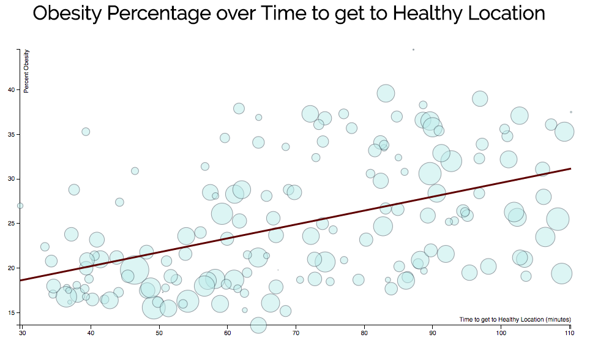

# Introduction
The city of Boston provides sets of data for different series of city services. We use datasets of different healthy locations and a dataset of locations with high percentages of adult obesity. With these datasets, we look for correlation between access to healthy locations in the form of travel time through public transportation and obesity percentages. With our results we will determine whether these healthy programs/locations are located in neighborhoods with higher levels of obesity, which need them the most

# Datasets
The healthy location datasets we use and created are:
* Orchards (https://data.cityofboston.gov/Health/Urban-Orchards/c7cz-29ak): Urban orchards and fruit trees in and around the city of Boston.
* Healthy Corner stores (https://data.cityofboston.gov/Health/Healthy-Corner-Stores/ekiy-2qmz): Corner stores and bodegas participating in the Healthy Corner Stores Initiative sponsored by the Boston Public Health Commission, and other community health center healthy corner store project locations.
* Community Culinary and Nutrition Programs (https://data.cityofboston.gov/Health/Community-Culinary-And-Nutrition-Programs/tma6-pdxu): Institutions and programs offering community-based culinary and nutrition education programming.
* Healthy Locations: combines the three data sets above and only includes the type of healthy location and its longitude and latitude coordinates.

The following are the other datasets we gathered online:
* Obesity among Adults (https://chronicdata.cdc.gov/500-Cities/500-Cities-Obesity-among-adults-aged-18-years/bjvu-3y7d): provides a list of obesity percentages for each location
* MBTA Bus and Subway Stops (http://realtime.mbta.com/developer/api/v2/routes): list of Subway and Bus stops on the MBTA for each route
* Big Belly Locations (https://data.cityofboston.gov/City-Services/Big-Belly-Locations/42qi-w8d7/): Locations of all Big Belly trash receptacles in the city.

The following are all the datasets we created in the transformations:
* Closest MBTA (Control/Health/Obesity): a list of closest MBTA stops for each control, healthy and obesity location. Combined from MBTA, big belly locations, healthy locations, and obesity data.
* Health Obesity and Control Obesity: the closest healthy/control location for each obesity location. Modified from the previous dataset. Each data entry also contains the shortest travel time (in minutes) from the obese location to the healthy/control location.
* Results and Linear Regression Data: linear regression data contains the RMSE, slope, MSE, and y-intercepts of the best fit linear regression for Obesity percentage vs min travel time. Results contains the same data, but with control linear regression as well.

# Transformations Performed
## Healthy Locations
We aggregated all of the health programs, stores and orchards into one dataset, with its type and location. We used select and project to clean and reformat the datasets. This generalizes the notion of a healthy location and allows us to have coordinates of healthy points.

## Closest MBTA stops to Control/Healthy/Obesity Locations
In order to prepare our data to calculating distance, we transformed each longitude and latitude coordinate into radians and stored it back into the dataset as well as the rectangular coordinates we originally had. This reduced runtime significantly because calculating radians each time we need to calculate distance takes almost three times the current runtime.

We, then, calculated the closest stops to each obesity area. We defined close as equal or less than a mile away. We used product to map all possible stop and obese combinations and calculated the distance between both using project. Then we used select to filter out all the far away stops. We then aggregated each obesity area together to form a list of stops for each area. Some limitations of this were because of the size of the datasets. Because product creates every possible combination of MBTA stops and locations, the program takes some time to run. 

## Closest Health Location to each Control/Obesity Location
For each control/obesity location, we calculated the closest healthy location. We put these in a dataset, with closest mbta data included as well (calculated above). We performed the same transformations as the previous closest MBTA transformations, but instead of the closest list of MBTA stops, we found the first closest healthy location. 

## Shortest Path
Using the closest MBTA stops (to Obesity and Healthy locations) found above, we calculate the shortest route to a healthy location from an obese location. We use Dijkstra's algorithm and the MBTA's dataset to find the shortest path between each obesity location and its closest healthy location. To do this, we create a graph of the MBTA (subway only) using networkx's DiGraph class. We then take a combination of the estimated time it would take to travel that route and the time it takes to walk the remaining distance and add that to a travel times list. 

For each location we use the shortest path function from networkx to receive an estimated travel time (in minutes) from nearby stops to a healthy locations MBTA stop. To account for travel to a MBTA stop, bus travel and walking travel, we used the Google API to calculate the minimum travel time and append it to the travel times list. In order to find the minimum travel time overall, we just simply took the min of the list of travel times.

The biggest limitation of this technique is that we find the closest healthy location using the distance formula. Since the distance formula does not take the MBTA into account, it’s possible that there is a healthy location that is slightly farther away but would take less time to get to. Another limitation we ran into is the way the MBTA stores their bus data. It was impossible to use this in the algorithm or even to transform it to the format we needed. Instead, we used the Google API to calculate bus travel time.

## Linear Regression
We use linear regression to see how strong the correlation between access to healthy locations and obesity is. We formatted our data so that the X dataset is the estimated travel time and the Y dataset is the corresponding obesity percentage. By having our data set up like this, we can have results that will show decreasing the travel time to a healthy location, decreases the obesity levels in an area.

We used trash bins as a control to make sure that any correlation we find is specific to the obesity locations. Since trash cans are probably unrelated to the obesity in an area, we expected little or no correlation.  We found that there was a positive correlation with a slope of 16 between obesity and distance from a healthy location. This means that if we decrease the distance a person has to go to get healthy food we can drastically decrease the levels of obesity in that area. 

We ran our algorithm on a Control data and found that there was also a correlation between obesity and distance from a trash bin. While this does mean that there may be external factors contributing to the correlations, the correlation between obesity and distance of healthy locations was much stronger. 

# Results
According to our data, the mean squared error between obesity and healthy location distance was only 8.98 whereas our control data had a mean squared error of 14.15. This means that there is more significance to trying to predict obesity based on the distance from a healthy location. Both datasets ended up having similar rates of increase in obesity based on the distance from either trash bins or healthy locations.

# Conclusion

# Future Work
A few questions that we would like to address in a future work that we were not able to pursue are:
* Do areas with more than one healthy location have lower rates of obesity? If so, are these healthy locations helping lower obesity percentage?
* Would the introduction of a healthy location into an obese area lower the obesity rate over time?
* Could we predict an optimal point to place a healthy location based on our data?
