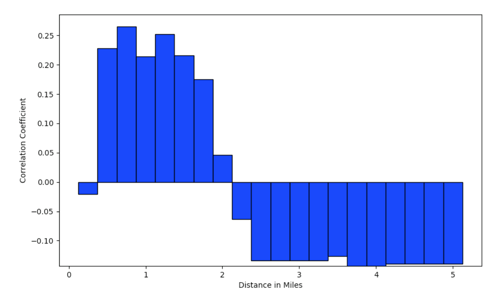
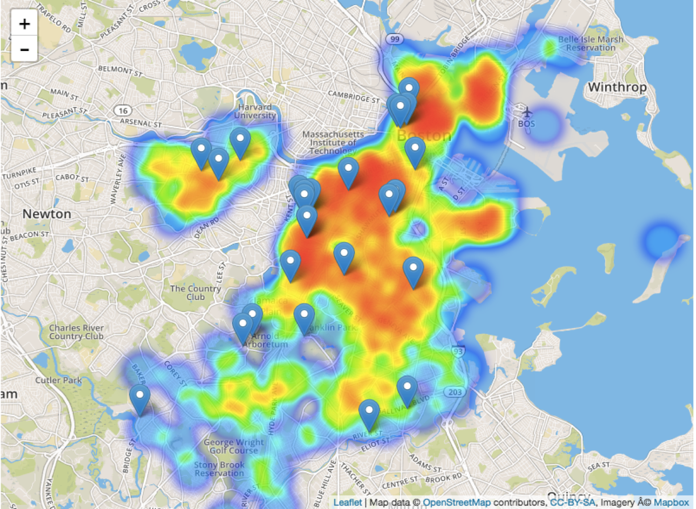

# Do You Live Too Far From A Hospital? 

Boston Univesity Department of Computer Science
CS591 L1 Spring 2017 - Data Mechanics

Professor Andrei Lapets

By [Pauline Ramirez](mailto:pgr@bu.edu) and [Carlos Syquia](mailto:syquiac@bu.edu)

## Introduction
For our project, we aimed to determine any correlations between certain medical issues and characteristics of Boston. Finding any statistically significant correlations could indicate what areas or characteristics of Boston should be invested in, whether it’s improving the city or making that feature more accessible. The main relationship we looked at were between one’s distance from their nearest hospital and the rate of yearly check ups. We also look at the relationship between obesity rate and the nearest swimming pool.

## Datasets
The main dataset we used was the [CDC500](https://chronicdata.cdc.gov/500-Cities/500-Cities-Local-Data-for-Better-Health/6vp6-wxuq), which contains health data (health conditions and healthy beahviors) for the 500 largest cities in the US. This was provided by the Chronic Disease Center, containing data from 2013 and 2014. 

We also used datasets provided by the City of Boston, namely the [Hospital locations](https://data.cityofboston.gov/Public-Health/Hospital-Locations/46f7-2snz), the [Healthy Corner Store locations dataset](https://data.cityofboston.gov/Health/Healthy-Corner-Stores/ekiy-2qmz), and the [Year-Round Swimming Pools datasets](https://data.cityofboston.gov/Public-Property/Year-Round-Swimming-Pools/rtqb-8pht/). We combined these datasets with the CDC500 in the following ways:

The first dataset (created by transformation0.py) is a dataset that has all records in the CDC500 dataset of people in Boston visiting their doctors and maps them to the hospital nearest to them. We suspect that the closer one lives to a hospital the likelier they are to go to their doctor for their yearly checkup. A lack of check ups could lead to undiagnosed diseases/injury so based on this information we can see the areas in Boston where doctors need to be more accessible.

The second dataset (created by transformation2.py) is a dataset that has the obesity rates of people in Boston and maps them to pools and healthy corner stores nearest to them. We want to see whether being close to either or both of these facilities reduce obesity rates, and could signal that there should be more of these facilities around.

There is also a third dataset (created by transformation1.py), where we used a data set to map data points in the CDC500 to their nearest universities in Boston. We used this to see if there was a relationship between low sleep rates (sleeping less than 7 hours a night) and distances to universities.

## Analysis
Once we had these datasets, we wanted to determine if there was any correlation between the following things:
	- Annual check ups and distance from nearest hospital
	- Obesity rate and distance from nearest public swimming pool

We then calculated the correlation coefficients in correlation_checkups_hospital.py and in correlation_pools_obesity.py, using the following formula:
> __Pearson product-moment correlation coefficient__:
> `ρ(x, y) = cov(x, y) / (σ(x) ⋅ σ(y))`


We also calculated the p-values of those correlation coefficients to determine statistical significance (a p-value of less than 0.05 is the standard). 

By default, correlations_checkups_hopsital.py calculates the correlation coefficient for all the data points. However, we also allowed the user to input the distance from the hospital they wanted to calculate the correlation coefficient from. In other words, this allows the user to ask a question like the following: “Does being 5 miles away from the nearest hospital affect the rate of yearly check-ups?”. We implemented the same feature in correlation_pools_obesity.py, allowing the user to inpute the distance from the pool.

## Results
After running our scripts, these are the results from correlation_checkups_hospital.py:
	- Correlation coefficient between distance from hospital and rate of yearly check ups: –0.16493
	- P-value: 0.03012

We can take note of a few things here: first, the coefficient is negative, signaling a negative relationship between the rate of visits to the doctor for a routine check up and the distance one is from a hospital. In other words, the further you are from a hospital, the less likely you are to visit for a routine check up.  Second, the p-value is less than 0.05, meaning that the correlation coefficient is statistically significant. However, the correlation coefficient is only -0.16, meaning that while distance from a hospital does affect the doctor visits rate, there are other factors that affect the rate as well (e.g. age, insurance, prior medical conditions etc.).

These are the results from correlation_pools_obesity.py;
	- Correlation coefficient: -0.130350062989
	– P-value: 0.0911832054196

While we also found a negative correlation between distance from the nearest swimming pool and the obesity rate, the p-value for this correlation coefficient is greater than 0.05, indicating statistical insignificance. Because we found this statistical insignificance, we decided not to pursue this relationship further in our project and focused solely on the other relationship.


## Visualizations
To further our analysis, we limited the distance from the hospital and recalculated the correlation for every quarter-mile (i.e. between 0 and 0.25 miles, 0 and 0.5 miles, 0 and 0.75 miles and so forth). The results of this can be seen in figure 1 below.



It seems that if you are up to two miles away from a hospital, you are more likely to visit your doctor the further you are from the nearest hospital, but once the distance passes this 2 mile threshold, the negative correlation we found earlier holds. Figure 2 below is a heat map that illustrates visually that there are higher rates of doctor visits the closer people are to a hospital, albeit there are outliers and exceptions.



## Website/Application
We developed a simple flask application that can illustrate the heatmap as well as allow for some user interaction. The page displays the correlation coefficient between the distance from the nearest hospital and the yearly check up rate, and lets the user input the radius with which they would like to calculate the correlation coefficient for. To run the application (ensure you are in the correct directory):

1. Run Mongo
```shell
sudo mongod 
```

2. Run the setup file to retrieve the data sets and perform the appropriate transformations
```shell
python3 setup.py
```

3. Run the flask application
```shell
export FLASK_APP=app.py
python3 -m flask run
```

## Conclusions and Implications
From our research, we were able to determine that there is a relationship between how far one is from a hospital and the rate of doctor visits. While there are other external factors to consider, it may be necessary to look into how to make these hospitals more accessible to people who live too far away. However, we do have to note the limitations of our statistical analysis. Other factors that could affect the rate of yearly check ups such as age, insurance policy, income and prior medical conditions were not considered in our analysis. Regression analysis could be a better way to make this analysis. 

## Further Work 
If we were to continue this project, we would focus on gathering more data so that we’re not looking at just hospital locations. This is because there are private clinics where primary care doctors do practice, but this is not included in the data set. We would also look at other data sets, especially income and health insurance rates, to see how this factor plays in with regards to the rate of people going in for their yearly checkup. Having this data could really help us isolate the true influence distance from the nearest hospital has on the yearly check up rate.


# Previous projects from earlier in the class

## Project 1
# Datasets we are using
1. CDC500 - https://chronicdata.cdc.gov/500-Cities/500-Cities-Local-Data-for-Better-Health/6vp6-wxuq
2. Higher Education Dataset - https://inventory.data.gov/dataset/032e19b4-5a90-41dc-83ff-6e4cd234f565/resource/38625c3d-5388-4c16-a30f-d105432553a4

3. Healthy Corner Stores in Boston – https://data.cityofboston.gov/Health/Healthy-Corner-Stores/ekiy-2qmz

4. Public Swimming Pools in Boston – https://data.cityofboston.gov/Public-Property/Year-Round-Swimming-Pools/rtqb-8pht/data

5. Boston Hospitals – https://data.cityofboston.gov/Public-Health/Hospital-Locations/46f7-2snz

# Narrative

For this project, we wanted to create datasets that could tell us whether certain medical conditions or measures (as they are called on the CDC dataset) can be correlated with given attributes of where the person lives (e.g. if a person lives near a hospital). We collect all the necessary datasets in retrieveData.py. We use the GeoPy API to find coordinates for datasets that do not provide that information.

The first dataset (created by transformation0.py) is a dataset that has all records in the CDC500 dataset of people in Boston visiting their doctors and maps them to the hospital nearest to them. We suspect that the closer one lives to a hospital the more often they would go visit their doctor. A lack of check ups could lead to undiagnosed diseases/injury so based on this information we can see the areas in Boston where doctors need to be more accessible.

The second dataset (created by transformation1.py) is a dataset that has all the people in Boston and Cambridge who sleep less than 7 hours and maps them to the nearest colleges/universities in Boston/Cambridge. We expect that these areas are populated by almost college students exclusively and therefore will have many people who sleep less than 7 hours.

The third dataset (created by transformation2.py) is a dataset that has the obesity rates of people in Boston and maps them to pools and "healthy corner stores" nearest to them. We want to see whether being close to either or both of these facilities reduce obesity rates, and could signal that there should be more of these facilities around.


## Project 2

With correlation_checkups_hospitals.py and correlation_pools_obesity.py, we want to find out if we are able to attribute certain behaviors, in this case annual check ups, to a characteristic of where one resides or how the number of swimming pools in one's proximity affects (if it does) obesity rates. 

In correlation_checkups_hospitals.py, we find the correlation coefficient and p-value between whether someone in Boston visited their doctor for an annual check up within the last year and their proximity to a hospital. We also give the user the option to restrict the distance from the hospital to see if there is a correlation between people who live within, say, a 1 mile radius of the hospital. Using this data, if there is a negative correlation between distance from the hospital and going to the doctors for an annual check up, we can determine whether people a given distance away from the hospital need to be given better access to their doctors.


In correlation_pools_obesity.py, we first find the number of pools within a user-given distance from a obesity rate data point. We then find the correlation coefficient and p-value between the number of pools around a given obesity rate data point and that data point's obesity rate. 

Both correlation1 and correlation2 give us a p-value, meaning we can determine whether the correlation is statistically significant (at least by current statistics standards) not only for the entire dataset but for slices of the data set, depending on the distance the user chooses. 
